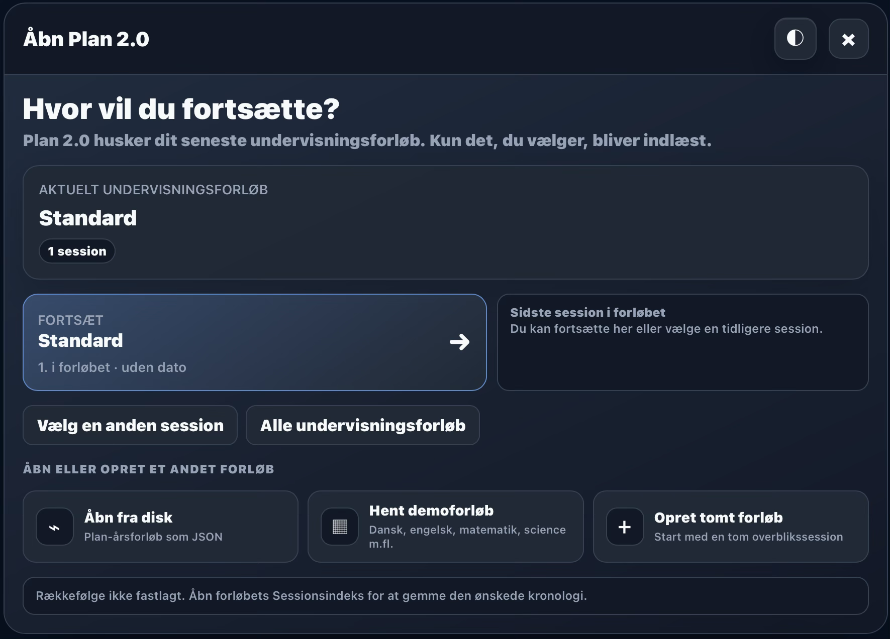

# Plan 2.0

> **En computer gemmer dine filer. Plan bevarer din undervisning.**

  

**Plan er lærerens arbejdsplads gennem skoleåret.**

Plan samler undervisningsforløb, sessioner, tavler, materialer, aktiviteter og data, så arbejdet kan fortsættes, udvikles og genbruges – også næste skoleår.

## Fire niveauer

**Undervisningsforløb → Sessioner → Tavler → Widgets**

Denne struktur gør undervisningen lettere at planlægge, gennemføre og genbruge.

## Derfor Plan

- Ét sted til hele skoleåret.
- Organiserer materialer, data og aktiviteter.
- Bevarer sammenhængen mellem dem.
- Lokale kopier af forløb og demoer.
- Sikker backup og nem flytning.

## Hjælp

Den indbyggede hjælp giver korte svar under arbejdet. [**Plan – Lærerhåndbog**](manualer/plan-2-laererhaandbog.pdf) er den samlede visuelle vejledning.
